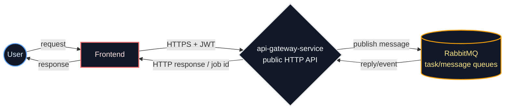
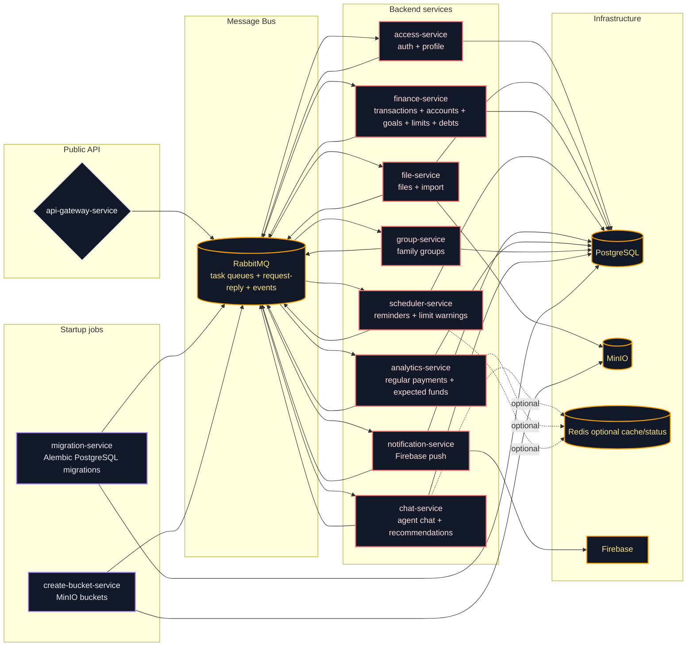
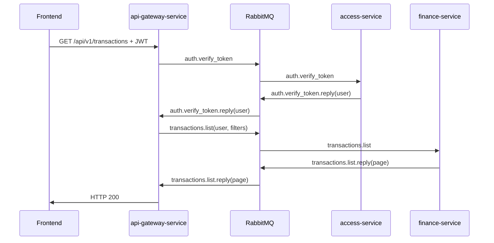
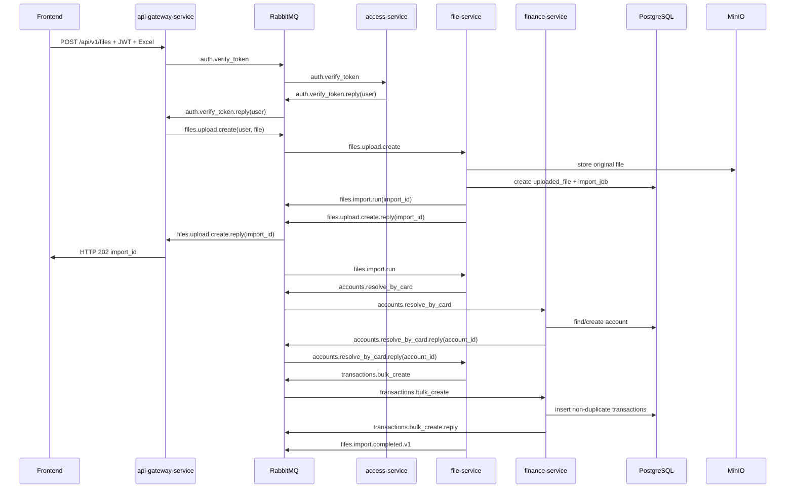
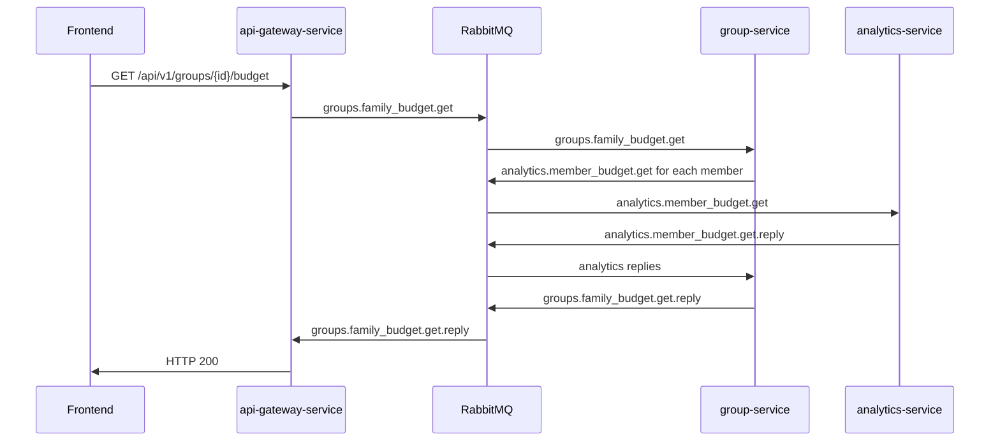

# Backend Architecture Levels
Date: 2026-05-30
Status: Draft
Source: `docs/backend-plan.md`

This document shows the current backend architecture after the service responsibility split.

## 1 Level: Public Boundary



Main idea:

- frontend talks only to `api-gateway-service`;
- `api-gateway-service` maps HTTP routes to RabbitMQ task messages;
- backend services do not expose business HTTP APIs;
- health/ready are technical probes only.

## 2 Level: Services And Infrastructure



## Service Responsibilities

| Component | Responsibility |
|-----------|----------------|
| `api-gateway-service` | public HTTP API, creates RabbitMQ task messages, waits for replies, returns public responses |
| `access-service` | registration, login, logout, refresh, me, profile patch, password change, JWT verification |
| `migration-service` | Alembic schema migrations at startup; optional dev data bootstrap |
| `create-bucket-service` | MinIO bucket creation at startup |
| `file-service` | uploaded files, MinIO storage, parsing source spreadsheets, import jobs/errors, import-origin account/transaction writes |
| `finance-service` | transactions list, accounts list, goals, limits, categories, debts, finance reads/writes |
| `scheduler-service` | reminders for expected charges and limit warnings |
| `notification-service` | device ids, notification permission/preference state, Firebase push, test notification |
| `analytics-service` | regular payment CRUD, regular cost detection, expected incomes, expected expenses, available balance for period |
| `group-service` | family groups, members, invitations, accept/decline, family budget assembly |
| `chat-service` | agent recommendations, chat list, chat history, chat messages |

## RabbitMQ Interaction Matrix

| Flow | Publisher | Consumer | Pattern | Message |
|------|-----------|----------|---------|---------|
| Register/login/logout/refresh/me | `api-gateway-service` | `access-service` | request-reply | `auth.*`, `auth.me.*` |
| Token verification | `api-gateway-service` | `access-service` | request-reply | `auth.verify_token` |
| File upload and CRUD | `api-gateway-service` | `file-service` | request-reply | `files.*`, `imports.*` |
| File import worker | `file-service` | `file-service` worker | background task | `files.import.run` |
| Create/reuse account during import | `file-service` | `finance-service` | request-reply | `accounts.resolve_by_card` |
| Save imported transactions | `file-service` | `finance-service` | request-reply | `transactions.bulk_create` |
| Transactions list | `api-gateway-service` | `finance-service` | request-reply | `transactions.list` |
| Accounts list | `api-gateway-service` | `finance-service` | request-reply | `accounts.list` |
| Goals CRUD | `api-gateway-service` | `finance-service` | request-reply | `goals.*` |
| Limits CRUD | `api-gateway-service` | `finance-service` | request-reply | `limits.*` |
| Categories CRUD | `api-gateway-service` | `finance-service` | request-reply | `categories.*` |
| Debts CRUD | `api-gateway-service` | `finance-service` | request-reply | `debts.*` |
| Reminder planning | `scheduler-service` | `finance-service` / `analytics-service` | request-reply | finance/analytics queries |
| Notification delivery | `scheduler-service` | `notification-service` | background task | `notifications.send` |
| Notification devices/test | `api-gateway-service` | `notification-service` | request-reply | `notifications.*` |
| Regular payments CRUD | `api-gateway-service` | `analytics-service` | request-reply | `analytics.regular_expenses.*` |
| Analytics reads | `api-gateway-service` | `analytics-service` | request-reply | `analytics.*` |
| Family budget | `group-service` | `analytics-service` | request-reply | `analytics.member_budget.get` |
| Group CRUD/invitations | `api-gateway-service` | `group-service` | request-reply | `groups.*`, `group_invitations.*` |
| Chat/recommendations | `api-gateway-service` | `chat-service` | request-reply | `chats.*`, `chat_messages.*`, `chat.recommendations.initial.get` |

## Message Context

Every RabbitMQ task/message uses a common envelope:

```json
{
  "message_id": "uuid",
  "correlation_id": "uuid",
  "type": "transactions.list",
  "source": "api-gateway-service",
  "reply_to": "reply.api-gateway-service.uuid",
  "created_at": "2026-05-30T12:00:00Z",
  "user": {
    "id": "uuid",
    "email": "user@example.com"
  },
  "payload": {}
}
```

Rules:

- `user.id` appears only after `access-service` verifies JWT;
- services validate required metadata before work;
- request-reply task messages must use timeout handling;
- consumers must be idempotent because messages can be redelivered;
- failed background tasks go to retry/dead-letter queues.

## 3 Level: Main Runtime Flows

### Authenticated Read



### File Import



### Family Budget



## Health And Ready

Every service exposes:

```text
GET /health
GET /ready
```

These are technical probes only and are not used for business communication.

## Related Documents

- `docs/backend-plan.md`
- `docs/backend-er-diagram.md`
