# Backend ER Diagram
Date: 2026-05-30
Status: Draft
Source: `docs/backend-plan.md`

This is the conceptual ER diagram for the current backend plan.

The diagram is intentionally conceptual: exact PostgreSQL columns may change during the first migration pass.

## ER Diagram

```mermaid
erDiagram
    %% access-service
    USERS ||--o{ REFRESH_SESSIONS : has

    %% file-service
    USERS ||--o{ UPLOADED_FILES : uploads
    USERS ||--o{ IMPORT_JOBS : starts
    USERS ||--o{ IMPORT_ERRORS : owns
    UPLOADED_FILES ||--o{ IMPORT_JOBS : processed_by
    IMPORT_JOBS ||--o{ IMPORT_ERRORS : reports

    %% finance-service, with file-service import writes
    USERS ||--o{ ACCOUNTS : owns
    USERS ||--o{ TRANSACTIONS : owns
    ACCOUNTS ||--o{ TRANSACTIONS : contains
    ACCOUNTS ||--o{ ACCOUNT_CATEGORIES : has
    ACCOUNTS ||--o{ CATEGORY_LIMITS : has
    ACCOUNTS ||--o{ SAVINGS_GOALS : has
    USERS ||--o{ USER_DEBTS : has
    ACCOUNTS ||--o{ USER_DEBTS : may_link
    ACCOUNT_CATEGORIES ||--o{ TRANSACTIONS : classifies
    ACCOUNT_CATEGORIES ||--o{ CATEGORY_LIMITS : limited_by
    UPLOADED_FILES ||--o{ TRANSACTIONS : sources
    IMPORT_JOBS ||--o{ TRANSACTIONS : imports

    %% analytics-service
    USERS ||--o{ REGULAR_EXPENSES : has
    USERS ||--o{ EXPECTED_INCOMES : has
    USERS ||--o{ EXPECTED_EXPENSES : has
    USERS ||--o{ AVAILABLE_FUNDS_SNAPSHOTS : has
    ACCOUNTS ||--o{ REGULAR_EXPENSES : analyzed_for
    ACCOUNTS ||--o{ EXPECTED_INCOMES : receives
    ACCOUNTS ||--o{ EXPECTED_EXPENSES : pays

    %% scheduler-service
    USERS ||--o{ SCHEDULED_REMINDERS : has
    REGULAR_EXPENSES ||--o{ SCHEDULED_REMINDERS : schedules
    CATEGORY_LIMITS ||--o{ SCHEDULED_REMINDERS : warns

    %% notification-service
    USERS ||--o{ NOTIFICATION_DEVICES : owns
    USERS ||--o{ NOTIFICATION_PREFERENCES : has
    USERS ||--o{ NOTIFICATION_DELIVERIES : receives
    NOTIFICATION_DEVICES ||--o{ NOTIFICATION_DELIVERIES : target
    SCHEDULED_REMINDERS ||--o{ NOTIFICATION_DELIVERIES : triggers

    %% group-service
    USERS ||--o{ FAMILY_GROUPS : creates
    USERS ||--o{ FAMILY_MEMBERS : joins
    USERS ||--o{ FAMILY_INVITATIONS : receives
    FAMILY_GROUPS ||--o{ FAMILY_MEMBERS : contains
    FAMILY_GROUPS ||--o{ FAMILY_INVITATIONS : sends
    FAMILY_GROUPS ||--o{ ACCOUNTS : may_share

    %% chat-service
    USERS ||--o{ CHATS : owns
    CHATS ||--o{ CHAT_MESSAGES : contains
    CHATS ||--o{ AGENT_RECOMMENDATIONS : shows
    USERS ||--o{ CHAT_MESSAGES : writes

    USERS {
        uuid id PK
        string email UK
        string password_hash
        string display_name
        datetime created_at
        datetime updated_at
    }

    REFRESH_SESSIONS {
        uuid id PK
        uuid user_id FK
        string refresh_token_hash
        string status
        datetime expires_at
        datetime created_at
        datetime revoked_at
    }

    UPLOADED_FILES {
        uuid id PK
        uuid user_id FK
        string original_filename
        string content_type
        integer size_bytes
        string sha256
        string storage_bucket
        string storage_key
        string status
        datetime created_at
        datetime updated_at
    }

    IMPORT_JOBS {
        uuid id PK
        uuid user_id FK
        uuid file_id FK
        string source_type
        string status
        integer total_rows
        integer parsed_rows
        integer failed_rows
        datetime started_at
        datetime finished_at
        datetime created_at
        datetime updated_at
    }

    IMPORT_ERRORS {
        uuid id PK
        uuid user_id FK
        uuid import_id FK
        string sheet_name
        integer row_number
        string column_name
        string raw_value
        string error_code
        string message
        string technical_details
        datetime created_at
    }

    ACCOUNTS {
        uuid id PK
        uuid owner_user_id FK
        uuid family_group_id FK
        string bank_source
        string display_name
        string account_type
        string currency
        string card_last4
        decimal initial_balance
        boolean is_archived
        datetime created_at
        datetime updated_at
    }

    TRANSACTIONS {
        uuid id PK
        uuid user_id FK
        uuid account_id FK
        uuid category_id FK
        uuid import_id FK
        uuid source_file_id FK
        string type
        datetime operation_at
        datetime payment_at
        string status
        decimal operation_amount
        string operation_currency
        decimal payment_amount
        string payment_currency
        decimal cashback_amount
        string category_name
        string mcc
        string card_last4
        string description
        string dedupe_key
        json raw_payload
        datetime created_at
        datetime updated_at
    }

    ACCOUNT_CATEGORIES {
        uuid id PK
        uuid account_id FK
        uuid created_by_user_id FK
        string name
        string description
        string icon_key
        boolean is_archived
        datetime created_at
        datetime updated_at
    }

    CATEGORY_LIMITS {
        uuid id PK
        uuid account_id FK
        uuid category_id FK
        decimal limit_amount
        string currency
        integer period_days
        datetime period_started_at
        boolean is_active
        datetime created_at
        datetime updated_at
    }

    SAVINGS_GOALS {
        uuid id PK
        uuid account_id FK
        uuid owner_user_id FK
        string title
        string description
        decimal target_amount
        decimal current_amount
        string currency
        date target_date
        string status
        datetime created_at
        datetime updated_at
    }

    USER_DEBTS {
        uuid id PK
        uuid owner_user_id FK
        uuid account_id FK
        string title
        string description
        string debt_type
        decimal remaining_balance
        decimal credit_limit
        decimal monthly_payment
        string currency
        integer payment_day
        integer overdue_days
        decimal interest_rate
        string status
        datetime created_at
        datetime updated_at
    }

    REGULAR_EXPENSES {
        uuid id PK
        uuid user_id FK
        uuid account_id FK
        uuid category_id FK
        string title
        string description
        string merchant_pattern
        decimal expected_amount
        decimal average_amount
        string currency
        integer frequency_days
        datetime next_expected_at
        decimal confidence
        string source_type
        string status
        datetime created_at
        datetime updated_at
    }

    EXPECTED_INCOMES {
        uuid id PK
        uuid user_id FK
        uuid account_id FK
        string source_pattern
        decimal expected_amount
        string currency
        date expected_at
        decimal confidence
        datetime created_at
        datetime updated_at
    }

    EXPECTED_EXPENSES {
        uuid id PK
        uuid user_id FK
        uuid account_id FK
        uuid regular_expense_id FK
        decimal expected_amount
        string currency
        date expected_at
        decimal confidence
        datetime created_at
        datetime updated_at
    }

    AVAILABLE_FUNDS_SNAPSHOTS {
        uuid id PK
        uuid user_id FK
        date period_start
        date period_end
        decimal actual_balance
        decimal expected_income_total
        decimal expected_expense_total
        decimal available_amount
        string currency
        datetime calculated_at
    }

    SCHEDULED_REMINDERS {
        uuid id PK
        uuid user_id FK
        uuid regular_expense_id FK
        uuid category_limit_id FK
        string reminder_type
        string status
        datetime scheduled_at
        datetime sent_at
        datetime created_at
        datetime updated_at
    }

    NOTIFICATION_DEVICES {
        uuid id PK
        uuid user_id FK
        string device_id UK
        string platform
        string firebase_token
        boolean is_active
        datetime created_at
        datetime updated_at
    }

    NOTIFICATION_PREFERENCES {
        uuid id PK
        uuid user_id FK
        boolean push_enabled
        datetime updated_at
    }

    NOTIFICATION_DELIVERIES {
        uuid id PK
        uuid user_id FK
        uuid device_id FK
        uuid reminder_id FK
        string notification_type
        string status
        string error_message
        datetime created_at
        datetime sent_at
    }

    FAMILY_GROUPS {
        uuid id PK
        uuid created_by_user_id FK
        string name
        string description
        datetime created_at
        datetime updated_at
    }

    FAMILY_MEMBERS {
        uuid id PK
        uuid family_group_id FK
        uuid user_id FK
        string role
        string status
        datetime joined_at
        datetime created_at
        datetime updated_at
    }

    FAMILY_INVITATIONS {
        uuid id PK
        uuid family_group_id FK
        uuid invited_by_user_id FK
        uuid invited_user_id FK
        string invited_email
        string status
        string message
        datetime expires_at
        datetime created_at
        datetime updated_at
    }

    CHATS {
        uuid id PK
        uuid user_id FK
        string title
        string status
        datetime created_at
        datetime updated_at
    }

    CHAT_MESSAGES {
        uuid id PK
        uuid chat_id FK
        uuid user_id FK
        string role
        string content
        datetime created_at
    }

    AGENT_RECOMMENDATIONS {
        uuid id PK
        uuid chat_id FK
        uuid user_id FK
        string agent_key
        string title
        string content
        decimal confidence
        datetime created_at
    }

    SCHEMA_MIGRATIONS {
        string version PK
        datetime applied_at
    }

    BUCKET_BOOTSTRAP_RUNS {
        uuid id PK
        string bucket_name UK
        string status
        datetime started_at
        datetime finished_at
        string error_message
    }
```



## Ownership Notes

| Entity | Owner |
|--------|-------|
| `users` | access-service |
| `refresh_sessions` | access-service |
| `uploaded_files` | file-service |
| `import_jobs` | file-service |
| `import_errors` | file-service |
| `accounts` | finance-service; file-service may create during import |
| `transactions` | finance-service; file-service may insert imported rows |
| `account_categories` | finance-service |
| `category_limits` | finance-service |
| `savings_goals` | finance-service |
| `user_debts` | finance-service |
| `regular_expenses` | analytics-service |
| `expected_incomes` | analytics-service |
| `expected_expenses` | analytics-service |
| `available_funds_snapshots` | analytics-service |
| `scheduled_reminders` | scheduler-service |
| `notification_devices` | notification-service |
| `notification_preferences` | notification-service |
| `notification_deliveries` | notification-service |
| `family_groups` | group-service |
| `family_members` | group-service |
| `family_invitations` | group-service |
| `chats` | chat-service |
| `chat_messages` | chat-service |
| `agent_recommendations` | chat-service |
| `schema_migrations` / `alembic_version` | migration-service (legacy → Alembic) |
| `bucket_bootstrap_runs` | create-bucket-service |

## Comments

- `access-service` owns identity and token/session data only.
- `file-service` owns original file lifecycle and import status. It can create/reuse accounts and insert imported transactions as part of import.
- `finance-service` owns user-facing finance CRUD/read behavior for accounts, transactions, goals, limits, categories, and user debts.
- `analytics-service` stores derived records and user-maintained forecast inputs. `regular_expenses` covers both automatically detected recurring expenses and manual records like subscriptions, rent, and utilities.
- `regular_expenses.source_type` should distinguish `detected`, `manual`, and `user_adjusted` records so automatic detection does not overwrite user edits.
- `regular_expenses.expected_amount` is the user-facing planned amount; `average_amount` can be filled by detection from transaction history.
- `scheduler-service` plans reminders, but `notification-service` sends them.
- `group-service` owns family membership and invitation state.
- `chat-service` owns recommendations/chats, but should request finance/analytics context through RabbitMQ instead of reading their tables directly.
- `user.id` is trusted only from RabbitMQ message metadata after `access-service` verifies JWT.
- Every imported transaction should have a dedupe key to avoid duplicate imports.

## Expected Early Indexes

```text
users(email) unique
refresh_sessions(user_id, status)
uploaded_files(user_id, sha256)
import_jobs(user_id, file_id)
import_errors(user_id, import_id)
accounts(owner_user_id, card_last4)
accounts(family_group_id)
transactions(user_id, operation_at)
transactions(user_id, account_id, operation_at)
transactions(user_id, category_id)
transactions(user_id, mcc)
transactions(user_id, card_last4)
transactions(user_id, import_id, dedupe_key) unique
account_categories(account_id, name)
category_limits(account_id, category_id)
savings_goals(account_id, status)
user_debts(owner_user_id, status)
user_debts(owner_user_id, debt_type)
regular_expenses(user_id, account_id, next_expected_at)
expected_incomes(user_id, expected_at)
expected_expenses(user_id, expected_at)
available_funds_snapshots(user_id, period_start, period_end)
scheduled_reminders(user_id, scheduled_at, status)
notification_devices(user_id, device_id) unique
family_members(family_group_id, user_id) unique
family_invitations(family_group_id, invited_email, status)
chats(user_id, updated_at)
chat_messages(chat_id, created_at)
```
