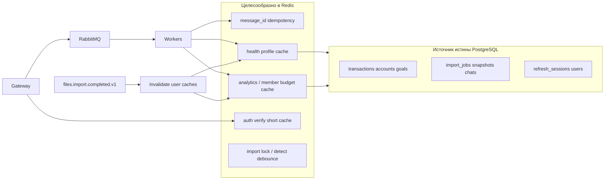

# Redis: что хранить и зачем

Date: 2026-05-31  
Status: Draft (design note)  
Scope: обоснование использования Redis в backend MVP Family Budget

Связанные документы: [backend-plan.md](backend-plan.md), [production-backlog.md](production-backlog.md), [backend-architecture-levels.md](backend-architecture-levels.md).

---

## Контекст

В стеке проекта Redis описан как **опциональный** слой для cache / status / idempotency ([backend-plan.md](backend-plan.md)). PostgreSQL остаётся источником истины по финансам, пользователям и долгоживущим сущностям. Внутренняя коммуникация сервисов — только через RabbitMQ; публичный HTTP — только через gateway.

Redis подходит для данных, которые:

- не обязаны быть единственной долговечной копией (или дублируются в PostgreSQL);
- часто читаются и дорого вычисляются (цепочки RPC, агрегации);
- требуют быстрых атомарных операций (идемпотентность, блокировки, rate limit);
- имеют естественный TTL или явную инвалидацию по событиям (`files.import.completed.v1`, смена пароля и т.д.).

---

## Роль Redis в архитектуре

---

## Уже реализовано

### Идемпотентность обработки RabbitMQ (`message_id`)

План требует поле `message_id` в envelope для защиты от повторной обработки. Реализация: `libs/common/common/redis_client.py` — `MessageIdempotencyGuard`, ключ `family-budget:msg:{message_id}`, `SET NX EX`, TTL из `REDIS_IDEMPOTENCY_TTL_SECONDS` (по умолчанию 86400).

**Почему Redis, а не PostgreSQL:**

- RabbitMQ доставляет сообщения как **at-least-once**; повтор возможен без ошибки в коде.
- Проверка «уже обрабатывали» должна быть O(1) и не засорять БД служебными строками.
- TTL освобождает память без отдельного GC.

**Что защищаем:** повторный `files.import.run`, фоновые задачи scheduler/notification, любые command/background handlers, где бизнес-идемпотентность на уровне таблиц неполная.

**Поведение при отказе Redis:** при `REDIS_ENABLED=false` или недоступности Redis guard отключается; остаётся защита на уровне БД (например `uq_transactions_user_dedupe_key` на транзакциях), но лишняя работа и события возможны.

Использование в воркере: `MessageWorker` в `libs/common/common/messaging.py` — при duplicate `message_id` возвращается `duplicate_skipped` без повторного handler.

### Проверка готовности (`/ready`)

Gateway и worker-сервисы вызывают `check_redis()` в readiness. Это операционный контракт («Redis доступен для idempotency и будущего кэша»), не бизнес-данные.

---

## Высокий приоритет (план и профиль нагрузки)

### Кэш профиля финансового здоровья `(user_id, period)`

В [backend-plan.md](backend-plan.md) (health-score-service): *optional Redis cache keyed by `(user_id, period)` with TTL aligned to import/analytics refresh*.

**Обоснование:**

- Пересчёт профиля — цепочка из многих синхронных RPC: транзакции (с пагинацией), суммы, счета, лимиты, цели, analytics (regular/expected/available balance).
- В decisions log: *snapshots + Redis cache required for acceptable latency*.
- Сейчас кэш реализован через `health_score_snapshots` в PostgreSQL; Redis в коде для profile **ещё не добавлен**, но назначение зафиксировано в плане.

**Что хранить:** сериализованный ответ `health.profile.get` и/или компактный `health.score.get` (или `profile_json` + `calculated_at`).

**TTL и инвалидация:**

- TTL до конца календарного месяца или фиксированный (1–6 ч) при редких изменениях;
- сброс по `files.import.completed.v1`, изменениям целей/лимитов, CRUD regular expenses;
- `refresh=true` — принудительный пересчёт и обновление кэша.

**Почему не только PostgreSQL:** dashboard и `chat-service` (`health.profile.get` при рекомендациях) создают повторяющуюся нагрузку; Redis снимает latency JSONB-чтений и нагрузку на pool при частых GET.

**Предлагаемый ключ:** `health:profile:{user_id}:{period}`.

---

### Кэш аналитики «доступные средства» и member budget

`analytics.available_balance.get` при вызове пишет в `available_funds_snapshots` — удобно для истории, но при частом опросе UI даёт лишние INSERT.

**Обоснование:**

- `analytics.member_budget.batch` считает бюджет для каждого участника семьи; один HTTP → group → N расчётов analytics.
- Риск таймаута gateway (`RPC_TIMEOUT_SECONDS`, по умолчанию 30 с) на семейном бюджете.

**Что хранить:** payload available balance / member budget по `(user_id, period_start, period_end)` + `calculated_at`.

**Инвалидация:** импорт транзакций, правки expected income/expense, regular expenses.

**Предлагаемые ключи:** `analytics:balance:{user_id}:{period_start}:{period_end}`; опционально агрегат `group:budget:{group_id}:{period}:{members_version}`.

Источник истины — таблицы analytics-service; Redis — read-through cache.

---

### Кэш результата `auth.verify_token` (gateway)

Каждый защищённый HTTP-запрос → RabbitMQ → `access-service` → decode JWT + загрузка user из PostgreSQL (`services/gateway/app/dependencies.py`).

**Обоснование:**

- Один Bearer на серии запросов SPA (транзакции, health, analytics, chats).
- Ключ: `hash(access_token)` → `{user_id, email, scopes, exp}`.
- TTL: `min(остаток жизни JWT, 30–120 с)`.

**Риски:**

- Смена пароля / удаление пользователя не видны до истечения TTL → короткий TTL или `DEL auth:cache:{user_id}*` при `auth.change_password` и revoke sessions.

**Не хранить:** refresh-токены (ротация и revoke в `refresh_sessions`, PostgreSQL).

**Предлагаемый ключ:** `auth:verify:{token_hash}`.

---

## Средний приоритет

### Распределённая блокировка импорта

Идемпотентность по `message_id` не исключает два **разных** сообщения на один `import_id` или перезапуск воркера mid-flight.

**Паттерн:** `SET import:lock:{import_id} NX EX` на время `process_import_job`.

Статус импорта в Redis целиком имеет смысл только при агрессивном polling (субсекундном); иначе достаточно `import_jobs` в PostgreSQL и `imports.status.get`.

---

### Debounce / lock для `analytics.regular_expenses.detect`

Тяжёлый SQL по транзакциям. Варианты:

- `detect:lock:{user_id}` на время job;
- `last_detect_at:{user_id}` — не чаще N часов без нового импорта.

---

### Версия данных пользователя для инвалидации

Единый счётчик `user:{user_id}:data_version` (INCR при import completed, CRUD finance/analytics), в ключах кэша — суффикс версии. Упрощает сброс всех кэшей пользователя без перечисления периодов.

---

## Низкий приоритет / обычно не в Redis

| Данные | Почему PostgreSQL (или другое хранилище) |
|--------|------------------------------------------|
| Транзакции, счета, цели, лимиты | Долговечность, фильтры, пагинация, аудит |
| Refresh sessions | Ротация, revoke, FK |
| Import jobs (полная модель) | Lifecycle, `import_errors` |
| Чаты и сообщения | Relational access |
| Device tokens, notification log | Доставка и аудит |
| Scheduler plans | Состояние напоминаний по плану |
| Списки транзакций с фильтрами | Много вариантов ключей, сложная инвалидация |

---

## Не рекомендуется без отдельного security-решения

- Долгоживущий кэш JWT без инвалидации после logout всех сессий / смены пароля.
- Единственная копия финансовых итогов только в Redis.
- Кэш ответов RabbitMQ по `correlation_id` (одноразовый request-reply).

Blacklist access-token по `jti` в Redis уместен только при введении мгновенного revoke до `exp` JWT; сейчас access JWT stateless, revoke идёт через `refresh_sessions`.

---

## Сводная матрица

| Категория | Пример ключа | Сервис(ы) | Статус |
|-----------|--------------|-----------|--------|
| Идемпотентность | `family-budget:msg:{message_id}` | все workers | Реализовано |
| Readiness | PING | gateway, workers | Реализовано |
| Health profile | `health:profile:{user_id}:{period}` | health-score-service | В плане, не в коде |
| Analytics balance | `analytics:balance:{user_id}:{period}` | analytics-service | Предложение |
| Family budget aggregate | `group:budget:{group_id}:{period}:{version}` | group-service | Предложение |
| Auth verify | `auth:verify:{token_hash}` | gateway (+ invalidation access-service) | Предложение |
| Import lock | `import:lock:{import_id}` | file-service | Предложение |
| Data version | `user:{user_id}:data_version` | любой publisher событий | Предложение |

---

## Переменные окружения (текущие)

См. `infra/.env.example`:

| Переменная | Назначение |
|------------|------------|
| `REDIS_HOST` | Хост Redis |
| `REDIS_PORT` | Порт (6379) |
| `REDIS_ENABLED` | Включить idempotency и readiness check |
| `REDIS_IDEMPOTENCY_TTL_SECONDS` | TTL ключей `message_id` (по умолчанию 86400) |

Для будущего кэша профиля/аналитики потребуются отдельные TTL и префиксы ключей (зафиксировать при реализации).

---

## Рекомендуемый порядок внедрения

1. Мониторинг и стабильность существующей idempotency (`REDIS_ENABLED`, healthcheck compose).
2. Кэш health profile — максимальный эффект по плану; snapshots в PG остаются для history.
3. Кэш analytics / family budget + инвалидация по `files.import.completed.v1`.
4. Короткий кэш `auth.verify_token` на gateway с инвалидацией при security-событиях.
5. Lock/debounce для import и regular-expense detect — по метрикам гонок и 504.

---

## Итог

Для MVP Redis наиболее оправдан там, где архитектура **умножает latency**: at-least-once RabbitMQ, цепочки request-reply и горячие read-path без требования хранить «правду» вне PostgreSQL. Реализовано: **idempotency** и **readiness**. Следующие шаги по плану и нагрузке: **health profile cache**, затем **analytics/member budget** и опционально **auth verify cache** — всегда с TTL и инвалидацией по событиям импорта и изменения данных, без переноса финансовых записей из PostgreSQL.
